# EEG Spectrogram Analysis using STFT 🧠📊

A MATLAB-based analytical system for epileptic EEG signal analysis using Short-Time Fourier Transform (STFT) and spectrogram visualization. This project implements spectrogram generation from scratch to investigate window types, sizes, overlapping ratios, and time-frequency resolution trade-offs.

[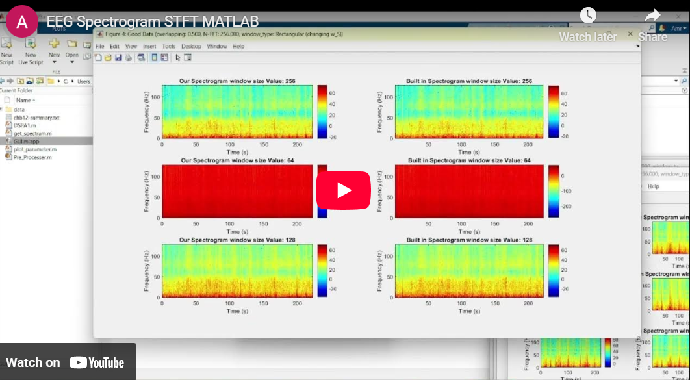](https://www.youtube.com/embed/-eynefx-WeI?si=aDDFVZ26DZhUDpwG)

## 📋 Description

This project builds an analytical system for epileptic electroencephalography (EEG) signals using spectrograms based on Short-Time Fourier Transform (STFT). The system processes EEG records from the CHB-MIT Scalp EEG Database, extracting ictal (seizure) and interictal (seizure-free) states for comprehensive analysis.

The implementation includes a complete STFT from scratch using only MATLAB's built-in FFT function, with extensive visualization and parameter investigation capabilities.

<br>
<div align="center">
  <a href="https://codeload.github.com/TendoPain18/eeg-spectrogram-stft-matlab/legacy.zip/main">
    
  </a>
</div>

## 🎯 Project Objectives

1. **Understand Spectrogram**: Implement STFT-based spectrogram from scratch
2. **Investigate Window Effects**: Analyze impact of window type, size, and parameters
3. **Study Overlapping**: Examine effects of different overlapping ratios
4. **Explore Time-Frequency Trade-off**: Understand resolution relationships
5. **Detect Epileptic Activity**: Compare normal vs. seizure EEG patterns

## ✨ Features

### Signal Processing
- **Custom STFT Implementation**: Built from scratch using FFT
- **Multi-Channel EEG Support**: Channel selection and averaging
- **Seizure Extraction**: Automatic ictal state extraction from annotations
- **Four Window Types**: Rectangular, Triangular, Hamming, Blackman

### Analysis Capabilities
- **Variable N-FFT**: Adjustable frequency resolution (64, 128, 256, 512 points)
- **Window Size Control**: Investigate time-frequency resolution trade-off
- **Overlap Ratio**: Configurable from 0% to 75% overlap
- **Comparative Visualization**: Side-by-side comparison with MATLAB built-in

### GUI Features
- **Interactive Channel Selection**: Checkbox-based multi-channel selection
- **Parameter Input**: Text boxes for N-FFT, overlap ratio, window size
- **Real-Time Processing**: Instant spectrogram generation
- **Dual Visualization**: Normal vs. abnormal signal comparison

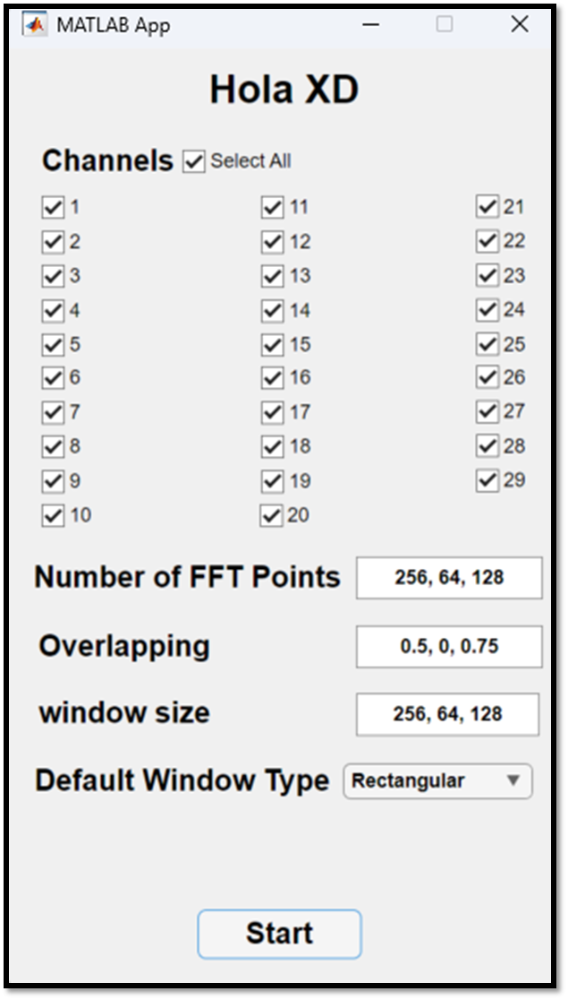

*MATLAB App Designer GUI for parameter configuration*

## 🔬 Theoretical Background

### Short-Time Fourier Transform (STFT)

**Definition:**
```
STFT{x[n]}(m, ω) = Σ x[n]w[n-m]e^(-jωn)
                    n=-∞
```

Where:
- `x[n]` = Input signal
- `w[n]` = Window function
- `m` = Time index
- `ω` = Frequency

**Spectrogram:**
```
S(m, ω) = |STFT{x[n]}(m, ω)|²
```

### Window Functions

**1. Rectangular Window:**
```
w[i] = 1    for 0 ≤ i ≤ M
```

**2. Triangular Window:**
```
w[i] = 1 - |i - (M-1)/2| / ((M-1)/2)
```

**3. Hamming Window:**
```
w[i] = 0.54 - 0.46 cos(2πi/M)
```

**4. Blackman Window:**
```
w[i] = 0.42 - 0.5 cos(2πi/M) + 0.08 cos(4πi/M)
```

Where `i = 0` to `M` for total of `M+1` points.

### Time-Frequency Resolution Trade-off

**Heisenberg Uncertainty Principle:**
```
ΔtΔf ≥ 1/(4π)
```

- **Short Window**: Good time resolution, poor frequency resolution
- **Long Window**: Good frequency resolution, poor time resolution

## 📊 Results & Analysis

### EEG Data Loading

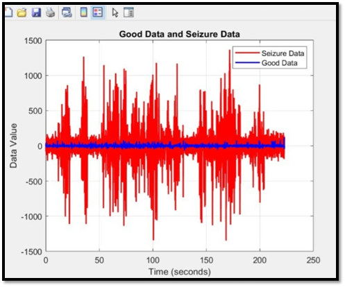

*Loaded EEG signals: Normal (blue) vs. Seizure (red)*

### Window Type Comparison

**Rectangular Window:**

<div align="center">
  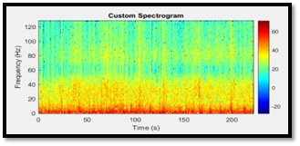
  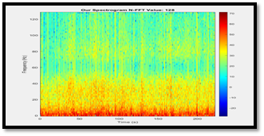
</div>

*Rectangular window: High spectral leakage, sharp transitions*

**Triangular Window:**

<div align="center">
  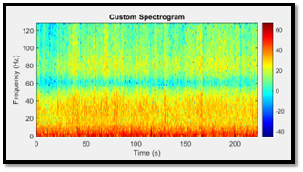
  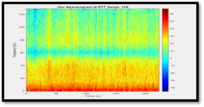
</div>

*Triangular window: Moderate leakage reduction*

**Hamming Window:**

<div align="center">
  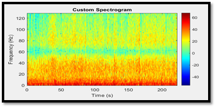
  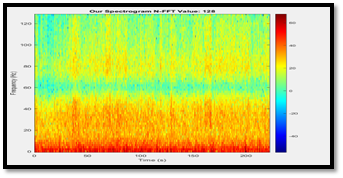
</div>

*Hamming window: Balanced approach with lower leakage*

**Blackman Window:**

<div align="center">
  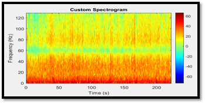
  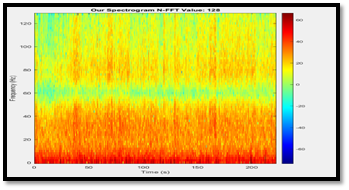
</div>

*Blackman window: Minimal leakage, reduced frequency resolution*

### N-FFT Point Variation

**N-FFT = 64:**

<div align="center">
  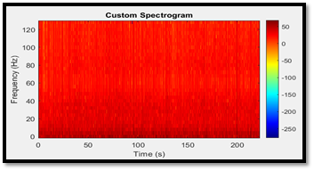
  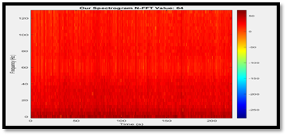
</div>

*N-FFT = 64: Low frequency resolution*

**N-FFT = 128:**

<div align="center">
  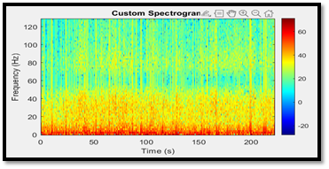
  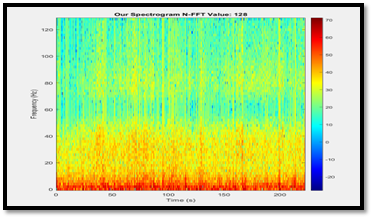
</div>

*N-FFT = 128: Improved frequency resolution*

**N-FFT = 256:**

<div align="center">
  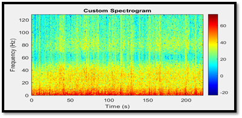
  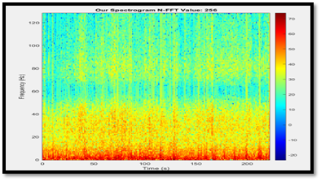
</div>

*N-FFT = 256: Good balance*

**N-FFT = 512:**

<div align="center">
  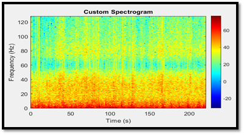
  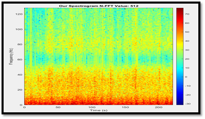
</div>

*N-FFT = 512: High frequency resolution*

### Overlap Ratio Effects

**Overlap = 0% (No Overlap):**

<div align="center">
  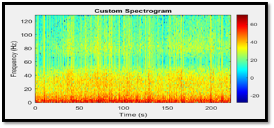
  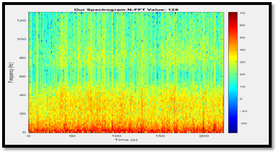
</div>

*No overlap: Discontinuous spectrogram*

**Overlap = 50%:**

<div align="center">
  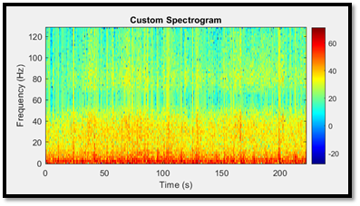
  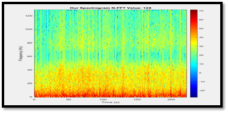
</div>

*50% overlap: Smooth transitions*

**Overlap = 75%:**

<div align="center">
  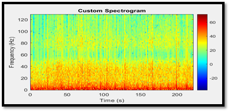
  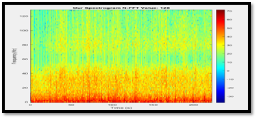
</div>

*75% overlap: Very smooth, higher computational cost*

## 🚀 Getting Started

### Prerequisites

**MATLAB Requirements:**
```
MATLAB R2018b or later
Signal Processing Toolbox
MATLAB App Designer
```

**Data Requirements:**
- CHB-MIT Scalp EEG Database files
- `chb12_29_data.mat` (with seizures)
- `chb12_32_data.mat` (seizure-free)
- `chb12-summary.txt` (annotations)

### Installation

1. **Clone the repository**
```bash
git clone https://github.com/yourusername/eeg-spectrogram-stft-matlab.git
cd eeg-spectrogram-stft-matlab
```

2. **Open MATLAB**
```matlab
cd 'path/to/eeg-spectrogram-stft-matlab'
```

3. **Run GUI**
```matlab
GUI  % Opens the App Designer interface
```

## 📖 Usage Guide

### Using the GUI

1. **Launch Application:**
```matlab
   GUI
```

2. **Select Channels:**
   - Check desired EEG channels (1-29)
   - Multiple channels will be averaged

3. **Configure Parameters:**
   - **N-FFT**: Enter comma-separated values (e.g., `64,128,256,512`)
   - **Overlap Ratio**: Enter values 0-1 (e.g., `0,0.5,0.75`)
   - **Window Size**: Enter sizes in samples (e.g., `128,256,512`)
   - **Window Type**: Select from dropdown

4. **Process:**
   - Click **Start** to generate spectrograms
   - Results display in separate figure windows

### Command-Line Usage
```matlab
% Define parameters
channels = [1, 6, 7, 8, 11, 12];  % Selected channels
N_FFT = [64, 128, 256, 512];      % FFT points
overlapping = [0, 0.5, 0.75];     % Overlap ratios
window_size = [128, 256, 512];    % Window sizes
window_type = 'Hamming';          % Window type

% Run analysis
DSPA1(channels, N_FFT, overlapping, window_size, window_type);
```

## 🔧 Implementation Details

### STFT Implementation
```matlab
function [T, F, Spec] = get_spectrum(data, fs, N_FFT, overlapping, window_size, window_type)
    % Calculate overlap
    N_overlap = floor(overlapping * window_size);
    step_size = window_size - N_overlap;
    num_segments = floor((length(data) - window_size) / step_size) + 1;
    
    % Initialize spectrogram
    custom_spectrogram = zeros(N_FFT / 2 + 1, num_segments);
    
    % Process each segment
    for j = 1:num_segments
        start_idx = (j-1) * step_size + 1;
        end_idx = start_idx + window_size - 1;
        
        segment = data(start_idx:end_idx) .* window';
        fft_segment = fft(segment, N_FFT);
        custom_spectrogram(:, j) = abs(fft_segment(1:N_FFT / 2 + 1));
    end
    
    % Generate axes
    T = (0:num_segments-1) * step_size / fs;
    F = (0:N_FFT / 2) * (fs / N_FFT);
    Spec = custom_spectrogram;
end
```

### Seizure Extraction
```matlab
function [good_data, seizure_data] = get_good_and_bad_data(summary_file, fileNames, channels, fs)
    % Load data
    data = loadAndExtractMatrices(fileNames);
    
    % Parse seizure times from summary
    seizure_times = parseSeizureTimes(summary_file, fileName);
    
    % Extract seizure segments
    seizure_dict = extractSeizureData(seizure_times, data, fs);
    seizure_data = concatenateSeizureData(seizure_dict);
    
    % Average selected channels
    good_data = mean(good_data(:, channels), 2);
    seizure_data = mean(seizure_data(:, channels), 2);
end
```

## 🎓 Learning Outcomes

This project demonstrates:

1. **STFT Theory**: Understanding time-frequency analysis
2. **Window Functions**: Effects on spectral leakage and resolution
3. **Signal Processing**: EEG signal preprocessing and segmentation
4. **Epilepsy Detection**: Identifying ictal vs. interictal patterns
5. **MATLAB Programming**: GUI development, file I/O, visualization
6. **Parameter Optimization**: Trade-offs in spectrogram design

## 📈 Key Findings

### Window Type Effects

| Window | Main Lobe Width | Side Lobe Level | Best For |
|--------|----------------|-----------------|----------|
| Rectangular | Narrow | High (-13 dB) | Sharp transitions |
| Triangular | Medium | Medium (-27 dB) | General purpose |
| Hamming | Medium | Low (-43 dB) | Balanced analysis |
| Blackman | Wide | Very Low (-58 dB) | Minimal leakage |

### Resolution Trade-off

**Frequency Resolution:**
```
Δf = fs / N_FFT
```

**Time Resolution:**
```
Δt = Window_Size / fs
```

**Uncertainty Relation:**
```
Δt × Δf = Window_Size / N_FFT
```

### Overlap Effects

- **0% Overlap**: Fastest, discontinuous
- **50% Overlap**: Good balance, recommended
- **75% Overlap**: Smoothest, high computational cost

## 📊 Dataset Information

**CHB-MIT Scalp EEG Database:**
- **Patient**: chb12
- **Sampling Rate**: 256 Hz
- **Channels**: 29 EEG electrodes
- **Normal Recording**: chb12_32 (1 hour, no seizures)
- **Seizure Recording**: chb12_29 (6 seizures)

**Channel Positions:**
- FP1-F7, F7-T7, T7-P7, P7-O1 (left temporal)
- FP2-F4, F4-C4, C4-P4, P4-O2 (right frontal-central)
- FZ-CZ, CZ-PZ (central)
- And 18 additional channels

## 🤝 Contributing

Contributions are welcome! Feel free to:

- Add new window functions
- Implement additional features (wavelet transform)
- Improve seizure detection algorithms
- Enhance GUI functionality
- Add more analysis tools

## 📄 License

This project is licensed under the MIT License - see the [LICENSE](LICENSE) file for details.

## 🙏 Acknowledgments

- Course: CIE-442 Digital Signal Processing
- CHB-MIT Scalp EEG Database from PhysioNet
- *The Scientist and Engineer's Guide to Digital Signal Processing* - Chapter 16
- MATLAB Signal Processing Toolbox

<br>
<div align="center">
  <a href="https://codeload.github.com/TendoPain18/eeg-spectrogram-stft-matlab/legacy.zip/main">
    
  </a>
</div>

## <!-- CONTACT -->
<div id="toc" align="center">
  <ul style="list-style: none">
    <summary>
      <h2 align="center">
        🚀 CONTACT ME 🚀
      </h2>
    </summary>
  </ul>
</div>

<table align="center" style="width: 100%; max-width: 600px;">
  <tr>
    <td style="width: 20%; text-align: center;">
      <a href="https://www.linkedin.com/in/amr-ashraf-86457134a/" target="_blank">
        
      </a>
    </td>
    <td style="width: 20%; text-align: center;">
      <a href="https://github.com/TendoPain18" target="_blank">
        
      </a>
    </td>
    <td style="width: 20%; text-align: center;">
      <a href="mailto:amrgadalla01@gmail.com">
        
      </a>
    </td>
    <td style="width: 20%; text-align: center;">
      <a href="https://www.facebook.com/amr.ashraf.7311/" target="_blank">
        
      </a>
    </td>
    <td style="width: 20%; text-align: center;">
      <a href="https://wa.me/201019702121" target="_blank">
        
      </a>
    </td>
  </tr>
</table>

<!-- END CONTACT -->

## **Unlock the secrets of brain signals with STFT analysis! 🧠✨**
